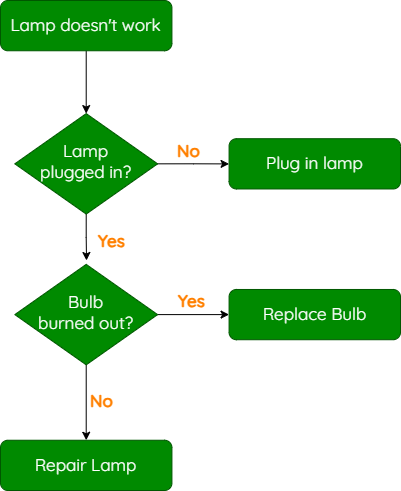

---
hide:
  - toc
---

# Simple Conditional Statements

!!! tip "Quick Links"

    * [Selection Explanation](#selection-explanation)
    * [If statements](#if-statements)
    * [Else Statements](#else-statements)
    * [Elif Statements](#elif-statements)

## Selection Explanation

Programs have to make decisions.

You have seen how these decisions can be represented on a flowchart (notice the diamond shapes with yes/no decisions).

<figure markdown="span">
  { width="400" }
</figure>

In National 5, you will often be asked to follow a design that has these decisions. You will implement the decisions in Python with if statements.

## If statements

Your programs will often react to something input by the user:

!!! example "The user is asked to enter a password. If they enter “hello123”, access is granted."

	```Python
		# Ask the user to enter a password
		passwd = input("Please enter the password")
		
		# Is access granted?
		if passwd == “hello123”:
			print("Access granted")
	```

The if statement always starts with the word if, followed by a condition. A condition checks that something is equal to, greater than or less than something else. In this case, it checks if passwd (what the user entered) is equal to the string “hello123”.

We use indentation for any code that we want to be inside the if statement (this means we tab it in). Notice that the print statement is tabbed in slightly from the left. This means that it only happens if the if statement above it is true. We could have multiple lines of code inside the if statement.
The if statement always ends in a colon :

** Note the use of the double-equals ==. We use two equals signs when checking for equality in an if statement. We can use the == signs for testing if any variable matches any other data. When our data is a number (whether it is an integer or a real number), we can see if it is less than or greater than another number **

| Symbols     | Description                                                     |
| ----------- | ----------------------------------------------------------------|
| `==`        | Equal to, e.g. 5 == 5, score == 12 or faveSubject == "Computing"|
| `<`         | Less than, e.g. 40 and 62 are both < 99                         |
| `>`         | Greater than, e.g. 50.4 and 85.1 are both > 10.8                |
| `<=`        | Less than or equal to, e.g. 22 and 70 are both <= 70            |
| `>=`        | Greater than or equal to, e.g. 100 and 105 are both >= 100      |

## Else Statements

Sometimes, we want the program to do something if data meets a condition, or otherwise, it is to do something else. This is called an else statement.

A program could check that someone’s age is greater than or equal to 17. If so, they are allowed to drive. 

If this is not so, they are not allowed to drive:

!!! example

	```Python
		# Ask the user for their age
		age = int(input("Please enter your age"))
		
		# Old enough to drive?
		if age >= 17:
			print("Broom broom")
		else:
			print("Sorry, no drive yet”)
	```
In these examples, the program always does one thing, or the other. They are mutually exclusive. You cannot be both age >= 17 and not >= 17 at the same time, so only one branch of the decision is carried out.

> Note that, as before, the if and else statements end in a colon :

The code that follows the if statement is indented (tabbed in). This means that it is only triggered if the if condition is true. The code after the else statement is indented. This means that the second print statement is only triggered if the condition is not true.

## Elif Statements

Sometimes, information comes in multiple categories.

We could ask for a test mark percentage. If the mark is greater than (or equal to) 70, the student gets an A. Otherwise, if their mark is greater than or equal to 60, they get a B. Otherwise (again), if their mark is greater than or equal to 50, they should get a C, and otherwise (finally) they receive no award.

This could be represented on a flowchart:

<figure markdown="span">
  { width="700" }
</figure>

This is very efficient, because the program only needs to check for a B or C if the person did not get an A. If they did get enough marks for an A, the program never has to check those conditions.

In Python, we create this with elif (short for else-if):

!!! example

	```Python
		# Ask for percentage mark
		mark = int(input("Please enter percentage mark"))

		# Check which category mark goes in
		if mark >= 70:
			grade = “A”
		elif mark >= 60:
			grade = “B”
		elif mark >= 50:
			grade = “C”
		else:
			grade = “F”

		# Print the grade
		print(grade)
	```

Elif is followed by a new condition (e.g. “else if mark is greater than or equal to 50…”)

If the mark is not greater than or equal to 50, the only other option is the “else” branch, which sets grade to F.


